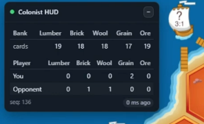

# colonist-state-tracker-poc

A short proof-of-concept that decodes Colonist.io WebSocket frames to reconstruct and display player resource counts in real time.

**Ethics & use**  
For educational and research purposes only. Do not use this tool to automate, exploit, or gain unfair advantage in live games. Respect Colonist.io’s Terms of Service.

**Purpose**  
Provide a lightweight, local tool for inspecting and visualizing resource state (including opponent counts in 1v1) for learning, debugging and protocol-analysis.

**Demo**  
Watch the demo: https://youtu.be/t9OhECEWiBU

## Screenshot

**Quick tech**  
- Tampermonkey userscript - hooks browser WebSocket frames  
- Node.js + Express - collects, decodes (MessagePack) and aggregates events  
- Minimal in-page HUD / web UI - live resource overview
